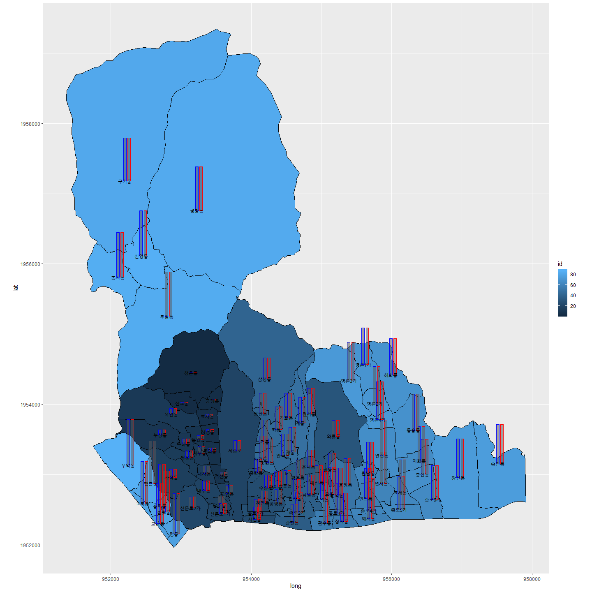

# R에서 한국지도 그려보기 (Drawing South Korea map in R)

ggplot을 사용하면, 다양한 그래프를 쉽게 그릴 수 있습니다.
하지만, 한국지도는 지도 데이터 파일로 읽어서, 그려야 하기 때문에 그리기 쉽지 않습니다.

kormap, kormap2014 패키지를 사용할 수 도 있지만, 5년전 지도 데이터라서, 사용하기 꺼려집니다.
지도나 지명은 매해 조금씩 변경되기 때문에, 되도록이면 최신 데이터를 사용하고 싶은 것이 사실입니다.

- GIS에서 사용하는 shape file을 사용하여, 한국지도를 그려보겠습니다.
- 2019년 5월 지도를 사용해서, 올해 지도를 그려보겠습니다.
- 동별로 그린뒤에, 동이름과, 바차트도 함께 그려 보겠습니다.

## 예제) 서울 종로구 동이름/바차트

